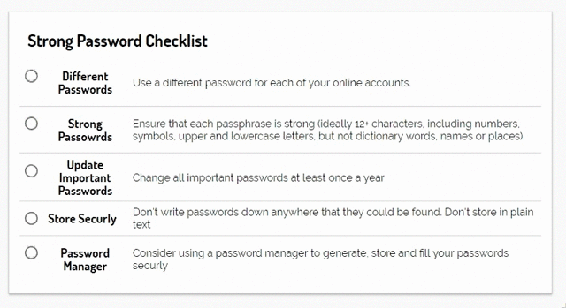

# Vue Checklist

A simple vue component for displaying checklist items

<p align="center"></p>

## Usage

### Install

`yarn add vue-checklist`

### Import and Use

```typescript
<template>
    <Checklist :theList="theList" title="An Example Checklist"/>
</template>

<script lang="ts">

import Vue from 'vue';
import Component from 'vue-class-component';
import { Checklist } from 'vue-checklist';

@Component({
    components: {
        Checklist,
    },
    data: () => {
        return  {
            theList: [
                { name: 'item 1', description: 'Lorem ipsum dolor sit amet', checked: false },
                { name: 'item 2', description: 'consectetur adipiscing elit, sed do eiusmod tempor incididunt ut labore et dolore magna aliqua', checked: false },
                { name: 'item 3', description: 'Ut enim ad minim veniam', checked: false },
            ],
        };
    },
})
export default class ChecklistExample extends Vue {}


</script>
```

## Contributing

If you find a bug, or have a feature suggestion, then feel free to raise an issue.

Pull requests are always welcome, either to add a feature, or to fix or improve something.

Building Locally:

 - **Clone**: `git clone https://github.com/Lissy93/vue-checklist.git && cd vue-checklist`
 - **Project setup**: `yarn install`
 - **Compiles and hot-reloads for development**: `yarn run serve`
 - **Compiles and minifies for production**: `yarn run build`
 - **Lints and fixes files**: `yarn run lint`
 - **Run the end-to-end tests**: `yarn run test:e2e`


## The MIT License (MIT)
### Copyright (c) Alicia Sykes <alicia@aliciasykes.com> 

Permission is hereby granted, free of charge, to any person obtaining a copy 
of this software and associated documentation files (the "Software"), to deal 
in the Software without restriction, including without limitation the rights 
to use, copy, modify, merge, publish, distribute, sub-license, and/or sell 
copies of the Software, and to permit persons to whom the Software is furnished 
to do so, subject to the following conditions:

The above copyright notice and this permission notice shall be included install 
copies or substantial portions of the Software.

THE SOFTWARE IS PROVIDED "AS IS", WITHOUT WARRANTY OF ANY KIND, EXPRESS OR 
IMPLIED, INCLUDING BUT NOT LIMITED TO THE WARRANTIES OF MERCHANT ABILITY, 
FITNESS FOR A PARTICULAR PURPOSE AND NON INFRINGEMENT. IN NO EVENT SHALL 
THE AUTHORS OR COPYRIGHT HOLDERS BE LIABLE FOR ANY CLAIM, DAMAGES OR OTHER 
LIABILITY, WHETHER IN AN ACTION OF CONTRACT, TORT OR OTHERWISE, ARISING FROM, 
OUT OF OR IN CONNECTION WITH THE SOFTWARE OR THE USE OR OTHER DEALINGS IN THE SOFTWARE.